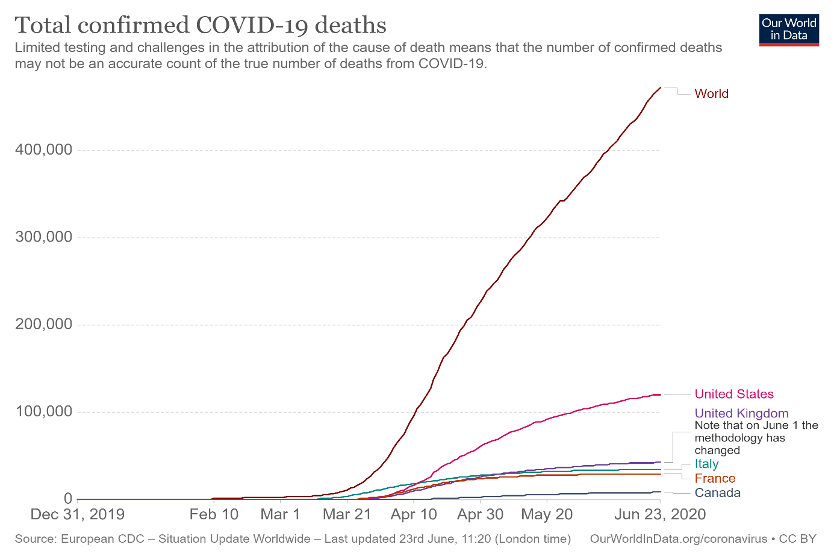

# Introduction 

The coronavirus disease, known as COVID-19, has been recognized as an infectious disease caused by a newly discovered coronavirus that originated in Wuhan, China in 2019. Some of the people infected with the virus have experienced mild or moderate discomfort, while others have lost their lives in a short time. The rate of spread and impact of the virus varies according to countries and age groups.

The Covid-19 pandemic is actually more than a health crisis, affecting communities and economies. The impact of the pandemic varies from country to country, suggesting that the pandemic will likely increase poverty and inequalities on a global scale. From this perspective, the impact of the crisis on communities, economies and vulnerable groups must be assessed and the responses of governments to recover from the crisis should be analysed [@UNDP2020].



Covid-19, which has devastating effects on human health, has also affected people's psychological, social and economic situations. New concepts such as "social distancing" have been introduced in social life, and medical materials such as "mask" and "gloves" have become essential for people. The capitalist system has been called into question again and the debate over whether capitalism should be replaced by a new economic system has been sparked. In this context, some question marks have arisen regarding the adequacy of the various groups and unions formed by the countries, and the economic strength of these unions has started to be questioned. In many countries that have survived the Covid-19 process, new security measures have been introduced in the political, social and economic dimensions under the name of "new normal".

In general, the "unknown" situation created by pandemics makes it difficult for countries to draw political and economic roadmaps. While some of the pandemics can be controlled in a short time, some of them cause various diseases that spread rapidly and are difficult to control. For example, the H1N1 flu of 2009 was widespread, but not as deadly; the Centers for Disease Control estimate there were 60 million cases in the U.S., resulting in fewer than 13,000 deaths [@CDCP2019]. 

When covid-19 and its effects were evaluated, the closest comparison in modern times was the Spanish flu, which occurred more than a century ago. This flu affected the world from 1918 to 1919. As a result of this virus, approximately 500 million people have been infected with the disease and approximately 50 million people worldwide are estimated to have lost their lives [@CDCP2019a].

The Covid-19 mortality rate is lower than the Spanish flu for now, but it has had major economic impacts all over the world. Wu et al. [-@Wu2020a] says that: 

>“Because the underlying virus is so contagious—a group of researchers from the University of Hong Kong and Harvard estimated that one-quarter to one-half of the world’s population is likely to contract the virus ‘absent drastic control measures or a vaccine’—governments around the world are taking drastic measures to control its spread.”

The COVID-19 pandemic is not only a health crisis, but an economic one as well Governments are introducing measures to promote public health such as social distancing and closing of non-essential businesses. These measures help slow the spread of the pandemic but also have a negative consequence on the greater economy, including increasing unemployment, negatively impacting individual’s income and savings etc.
 
Covid-19 had a significant impact on the labor force. Among the nine wealthy democracies the United States experienced the largest increase in official unemployment measures. At least 12 countries have helped their employees through employers and prevented large-scale unemployment. In all, in 20 countries representing 660 million workers, 38 million of them applied for unemployment insurance as the pandemic continued. In the United States, 13% of workers currently receive unemployment insurance [@Rothwell2020].

# Importance of the Research

While many countries experience economic problems in cases like the pandemic, citizens in general are affected negatively by this situation. in this context, the economic plans created by the states are vital for the citizens who have difficulties in carrying out their daily work and whose work lives are interrupted in the context of emergency situations. Under Covid-19, this extraordinary and unexpected process involves the closure of many businesses, the downsizing of many companies, and the loss of many people's jobs and economic damage. In such an extraordinary situation, it is important that the state-citizen relationship should be established in a healthy way when looking at how citizens feel about the economic infrastructure that states have. New connections between “citizens ' expectations, feelings and thoughts” and “economic steps” that states have taken (or failed to appoint) may open the door to "new economic structures."

In this context, if the feelings of the citizens towards the economic effects of covid-19 can be understood, then what is expected from the state in economic terms is better laid out. In addition, positive changes can occur in states 'models of responding to citizens' needs and wishes. In this way, during a possible state of emergency, the state-citizen relationship is more clearly understood. The link between the bureaucratic state structuring from the top to the bottom and the social reaction from the bottom to the top can be established in a more accurate way.

# Methodology

Traditional methods of measuring public sentiment involve survey techniques that are expensive and do not reflect real-time changes in the population (which can change rapidly from day to day). Our research seeks to find new means of measuring public sentiment related to COVID-19 and governmental response. In particular, we propose using a sentiment analysis of Twitter data related to COVID-19 and other policy-related keywords (such as governmental actors in different geographic regions)

# Research questions

* Does Twitter sentiment correlate with traditional survey methods that measure public approval of governmental action related to COVID? (Looking at Leger surveys will examine this)
* What is the relationship between sentiment on Twitter related to COVID and the greater economy ie.economic indicators (unemployment rate, hiring probability, layoff rates, job mobility)?
+ Can we find proper keywords that indicate discussion about particular economic-related topics? (A topic analysis will examine this)
* How does this relationship differ across different countries, especially how it relates to the number of deaths, infections, lockdown strategies, among others.
+ Can we find proper keywords that indicate discussion about particular geographic areas and policies relevant to those areas? (A topic analysis will examine this)

# Data

```{r warning=FALSE}
#packages

library(dplyr)
library(ggplot2)
library(tidyr)
library(scales)
library(sjmisc)
library(psych)
library(MASS)
library(reshape2)
library(reshape)
library(ggpubr)
library(topicmodels)
library(tm)
library(tidytext)
library(dplyr)
library(SnowballC)
library(lubridate)
library(wordcloud2)
library(wordcloud)
library(syuzhet)
library(lubridate)
library(scales)
library(reshape2)

SICSS_Montreal <- read.csv("rehydrated_COVID_TweetIDs_MarchAprilMay_1Perc.csv",stringsAsFactors=FALSE) 

#Clean dataset: untoken the text

SICSS_Mont <- SICSS_Montreal %>%
  filter(lang=="en", grepl('Canada', user_location))%>%
  unnest_tokens(word,text)%>%
  anti_join(stop_words)%>%
  filter(!(word=="https"| 
             word=="rt"|
             word=="t.co"|
             word=="amp" | 
             word== "3"|
             word== "19"|
             word=="2"|
             word=="1"|
             word== "coronavirus"|
             word=="covid"|
             word=="covid19"|
             word=="it’s"|
             word=="i'm"))

SICSS_Mont %>%
  count(word, sort = TRUE) %>%
  filter(n > 100) %>%
  mutate(word = reorder(word, n)) %>%
  ggplot(aes(word, n)) +
  geom_col() +
  xlab(NULL) +
  coord_flip()

```

## Topic Modelling
```{r warning=FALSE}
#Version 1
# Load data
Tweets_topic <- read.csv("rehydrated_COVID_TweetIDs_MarchAprilMay_1Perc.csv",stringsAsFactors=FALSE)
# Pull the tweet text
Tweets_sec <- Tweets_topic %>% filter(lang=="en", grepl('Canada', user_location)) %>%
  pull(text) 
# Create a corpus of tweets for a Document-Term Matrix
corpus <- Corpus(VectorSource(Tweets_sec))
corpus <- tm_map(corpus, tolower)
corpus <- tm_map(corpus, removePunctuation)
corpus <- tm_map(corpus, removeWords, c("rt", "https", "t.co", stopwords("english")))
corpus <- tm_map(corpus, stemDocument)
# Create the Document Term Matrix
DTM <- DocumentTermMatrix(corpus)
# OPTIONAL: we can delete the less frequent terms, for this, change "DTM" below for "sparse_DTM"
#frequent_ge_20 <- findFreqTerms(DTM, lowfreq = 20)
#sparse_DTM <- removeSparseTerms(DTM, 0.995)
# Group the terms by topic
# OPTIONAL: we can change the "k" variable velow to set the number of topics. For now it's set at 6
tweet_lda <- LDA(DTM, k = 4, control = list(seed = 1234))
# Extract the "per topic per word" probabilities of a topic ("beta")
tweet_topics <- tidy(tweet_lda, matrix = "beta")
# Select the top terms per topic
tweet_top_terms <- tweet_topics %>%
  group_by(topic) %>%
  top_n(10, beta) %>%
  ungroup() %>%
  arrange(topic, -beta)
# Plot the different topics and the top words
tweet_top_terms %>%
  mutate(term = reorder_within(term, beta, topic)) %>%
  ggplot(aes(term, beta, fill = factor(topic))) +
  geom_col(show.legend = FALSE) +
  facet_wrap(~ topic, scales = "free") +
  coord_flip() +
  scale_x_reordered()


#Version 2
tidy_dtm <- SICSS_Mont %>%
  filter(!(word=="https"|
             word=="rt"|
             word=="t.co"|
             word=="amp")) %>%
  count(word) %>%
  cast_dtm(word, word, n)

tweet_topic_model<-LDA(tidy_dtm , k=4, control = list(seed = 321))

topics <- tidy(tweet_topic_model, matrix = "beta")

top_terms1 <- topics %>%
  group_by(topic) %>%
  top_n(10, beta) %>%
  ungroup() %>%
  arrange(topic, -beta)


top_terms1 %>%
  mutate(term = reorder_within(term, beta, topic)) %>%
  ggplot(aes(term, beta, fill = factor(topic))) +
  geom_col(show.legend = FALSE) +
  facet_wrap(~ topic, scales = "free") +
  coord_flip() +
  scale_x_reordered()

```
# Results

* Topic analysis did not reveal clear topics, but some words related to geographic location (e.g. Canada, U.S) and political leaders (e.g. Trump, Trudeau) were found to occur frequently.
+ ‘Canad*’ and ‘Trudeau’ were used as keywords to specify tweets that were talking about Canadian issues. 
* Spearman correlations were conducted between twitter sentiment (ratio of positive words / negative words) aggregated by week, and survey data of Canadian opinion towards various topics, measured weekly
+ tweet positivity and approval of measures at federal level r= 0.81 
+ tweets positivity and approval of measures from provincial gov r=0.75
+ tweet positivity and proportion that was exposed to the virus r= -0.59
+ tweets positivity and proportion of people that think the pandemic is currently at its worst stage (being optimistic for future) r=0.89
+ tweets positivity and proportion of people that do not commit with measures in place r = -0.5
+ tweets positivity and proportion of people that think the pandemic threat is blown out of proportion r=- 0.8

# Discussion
* Twitter sentiment appears to be predictive of public attitudes regarding the government response to COVID
* Shortcoming: small sample of weekly survey data (N = 10) limits generalizability
* Future work: replicate results with USA, provincial data, different countries
* Future work: more sophisticated multivariate statistical analysis, time-series

# References